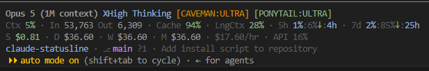
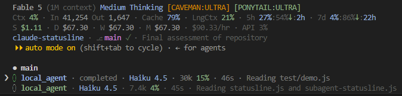

# Claude Code Statusline

A Node.js statusline for Claude Code. Renders model identity, context runway,
rate-limit pace, a persistent multi-window cost ledger, and repo and git state
in four lines. Runs on Windows, macOS and Linux from the same files.

```
Opus 5 (1M context) XHigh Thinking [FAST] [CAVEMAN:ULTRA] [PONYTAIL:ULTRA]
Ctx 15% · In 152,000 Out 153,470 · Cache 98% · LngCtx 76% · 5h 90%:20%↑ 02:41:4h · 7d 52%:50%→ 08:06:3d
S $4.87 · D $24.14 · W $88.02 · M $412.60 · $19.48/hr · API 25%
my-project · ⎇ main +2 ~1 ?3 ⇡1 ⇣2 · [feature-xyz] · statusline-hardening
Subagent Active: cavecrew-reviewer
```





Lines run fastest-changing to slowest: context and rate limits move on every
response, cost moves with them, and branch/working-tree state barely moves
within a turn — so the repo row sits at the bottom.

A companion script renders the agent panel below the prompt:

```
cavecrew-investigator · Opus 5 XHigh · 42k 4% · 1m · grepping src/
code-reviewer · Haiku 4.5 Medium · 181k 91% · 9s · Review the diff on branch main
```

| | |
|---|---|
| Install | One piped command — see [Installation](#installation) |
| Scripts | `~/.claude/statusline.js` (1335 lines) · `~/.claude/subagent-statusline.js` (325 lines) |
| Ledger | `~/.claude/cost_ledger.json` (created on first run) |
| Config | `statusLine` and `subagentStatusLine` blocks in `~/.claude/settings.json` |
| Runtime | Node.js ≥ 14.17 — built-ins only (`fs`, `path`, `os`, `child_process`; `https`/`crypto` lazily, in the optional updater). No dependencies. |
| Platforms | Windows, macOS, Linux |
| Cost | ~147 ms per render inside a git repo, ~63 ms outside one. ~66 ms for the subagent panel. No API tokens. |
| Licence | MIT |

---

## What's in this repo

```
statusline.js             the status line above the footer
subagent-statusline.js    one row per subagent in the agent panel
install.js                installer, updater and uninstaller in one file
examples/                 mock payloads, plus a transcript that proves the dedup
test/run.js               59 assertions, no framework
test/demo.js              renders every scenario with live timestamps
```

Try it before installing anything. Both commands are read-only and run against a
throwaway config directory, so neither touches your real ledger or settings:

```
node test/demo.js     # every scenario, with live pace arrows
node test/run.js      # 59 passed, 0 failed
```

---

## Platform support

All three files are plain Node with no native modules, no shell invocation, and
no platform-specific file layout. The entire platform-conditional surface is
these two lines:

| Location | What it does elsewhere |
|---|---|
| `process.platform === 'win32'` guard around `%APPDATA%` | Skipped; plugin config resolves via `$XDG_CONFIG_HOME` then `~/.config/<plugin>/`, which is where the plugins put it on macOS and Linux |
| `windowsHide: true` on the spawns | Ignored by POSIX |

The installer is the same story: `node -` reads a script from stdin identically
in bash, zsh and PowerShell, which is the whole reason it is one file and not a
`.sh`/`.ps1` pair.

Everything else — `os.homedir()`, `path.join`, the `git` lookup, atomic rename,
detached background spawn, the transcript byte offsets — behaves identically.
`fs.readSync(0, …)` with `EAGAIN` retry matters *more* on POSIX, where a
non-blocking stdin pipe is the common case.

The Node floor is 14.17, set by `fs.statSync(…, { throwIfNoEntry: false })`.
Nothing else in either file is newer.

Two honest caveats:

- **The timings above were measured on Windows.** Process spawn is cheaper on
  macOS and Linux, so the git-enabled figure should come in lower there. The
  non-git path is dominated by Node startup and will be similar.
- **These scripts have been executed and regression-tested on Windows only.**
  Nothing in them is Windows-dependent, but that is an audit result, not a test
  result.

---

## Installation

One command. Node ≥ 14.17 is the only prerequisite, and it is one you already
have if the statusline is going to run at all.

**macOS · Linux · WSL · Git Bash**

```
curl -fsSL https://raw.githubusercontent.com/GridFlowTech/claude-statusline/main/install.js | node -
```

**Windows PowerShell**

```
irm https://raw.githubusercontent.com/GridFlowTech/claude-statusline/main/install.js | node -
```

**From a clone**

```
git clone https://github.com/GridFlowTech/claude-statusline
cd claude-statusline
node install.js
```

All three run the same `install.js`. Copying the two scripts into
`$CLAUDE_CONFIG_DIR` (or `~/.claude`), adding `statusLine` and
`subagentStatusLine` to `settings.json`, and backing that file up first are all
part of the one command — there are no manual steps left.

They differ in one respect, and it is decided by how the installer was started
rather than by what is in your working directory:

- **Piped** — always downloads the published scripts. It does this even if you
  happen to be standing in a checkout, because the one-liner means "install the
  published version", and quietly picking up a stale working tree instead would
  be a nasty surprise.
- **`node install.js`** — installs the checkout it lives in.

`--local` and `--remote` override either way.

The bar appears on the next assistant message. No restart.

### Why one Node file and not `install.sh` + `install.ps1`

`node -` reads a script from stdin, so the same file is both the piped one-liner
and the local installer, in every shell, on every platform. A shell pair would
be two implementations of one contract that drift the moment only one of them
gets a fix. And the runtime is free: Node is already a hard requirement.

### Options

```
--dry-run           print every action, change nothing
--auto-update       check GitHub for a newer statusline once a day (off by default)
--no-auto-update    turn a previously enabled auto-update back off
--main-only         install the status line, not the subagent panel
--subagent-only     install the subagent panel, not the status line
--interval <sec>    statusLine refreshInterval (default 30)
--ref <branch|tag>  install from a specific ref (default main)
--dir <path>        target config dir (default $CLAUDE_CONFIG_DIR or ~/.claude)
--local | --remote  force copying from this checkout, or downloading
--uninstall         remove the settings keys and the installed scripts
--purge             with --uninstall, also delete cost_ledger.json
--help              the list above
```

Flags pass through the pipe. Read before you run:

```
curl -fsSL https://raw.githubusercontent.com/GridFlowTech/claude-statusline/main/install.js | node - --dry-run
```

The two halves are independent — `--main-only` and `--subagent-only` install
either without the other. See
[Subagent status lines](#subagent-status-lines-a-separate-feature).

### What it writes

| Path | What |
|---|---|
| `<config>/statusline.js` | the status line, written by atomic rename |
| `<config>/subagent-statusline.js` | the subagent panel, same |
| `<config>/settings.json` | `statusLine` + `subagentStatusLine` keys; every other key preserved |
| `<config>/settings.json.bak` | copy of your settings taken before the write |
| `<config>/.statusline-manifest.json` | sha256 of what was installed, for the update edit-check |
| `<config>/.statusline-autoupdate` | flag file, only with `--auto-update` |

`<config>` is `$CLAUDE_CONFIG_DIR` if set, else `~/.claude`. Nothing outside it
is ever touched, and `cost_ledger.json` is never written or deleted by the
installer.

Nothing is installed until **every** file has been fetched *and* has passed
`node --check`. A truncated transfer, a captive-portal login page or a 404 body
fails the run before the first byte is written. The `node --check` gate is the
one that matters: it parses each file exactly as Node will at render time.

If `settings.json` is not valid JSON, the installer refuses to touch it and
prints the two keys to add by hand. Overwriting a settings file it could not
parse would destroy your hooks, permissions and MCP servers.

### Windows path caveat

The installer handles this; it is documented because it explains the shape of
what lands in `settings.json`, and it still applies if you hand-edit.

On Windows, Claude Code routes statusline commands **through Git Bash when Git
Bash is installed**, and through PowerShell only when it is absent.

- **Forward slashes** (`C:/Users/you/.claude/statusline.js`) or `~`. Git Bash
  treats unquoted backslashes as escape characters, so a path written
  `C:\Users\you\.claude\statusline.js` arrives with its separators stripped and
  the command fails with no visible error — the bar just goes blank. The
  installer always writes forward slashes.
- **Never `%USERPROFILE%`.** cmd-style variables are not expanded by Git Bash.
  On macOS and Linux, `$HOME` has the same problem in reverse; `~` works
  everywhere.

No `chmod` is needed on any platform: the scripts are invoked as `node <path>`,
not executed directly, so the shebang and the executable bit are never used.

### By hand

Still two files and one key, if you would rather. Copy `statusline.js` and
`subagent-statusline.js` into `~/.claude/`, then add:

```json
{
  "statusLine": {
    "type": "command",
    "command": "node \"~/.claude/statusline.js\"",
    "refreshInterval": 30
  },
  "subagentStatusLine": {
    "type": "command",
    "command": "node \"~/.claude/subagent-statusline.js\""
  }
}
```

`~` is expanded by Claude Code on every platform, including Windows. A manual
install has no manifest, so [auto-update](#auto-update) stays off for it.

---

## Auto-update

**Off by default.** Turn it on at install time:

```
curl -fsSL https://raw.githubusercontent.com/GridFlowTech/claude-statusline/main/install.js | node - --auto-update
```

Off by default because the honest description of the feature is *this machine
runs code downloaded from GitHub on a schedule, without asking*. That is a
reasonable trade for a statusline you want to keep current, and a bad default to
impose on someone who did not ask for it. `--no-auto-update` turns it back off;
so does deleting `~/.claude/.statusline-autoupdate`.

When it is off, the whole feature costs one `statSync` per render.

When it is on, the render path still does no network I/O. It checks the age of a
marker file and, at most once a day, spawns a **detached** child that outlives
the render — the bar is already printed by the time the child does anything. The
child then refuses to install anything that is not, in order:

1. listed in the manifest written at install time,
2. byte-identical to what that install put on disk,
3. over 4 KB and starting with the expected shebang,
4. parseable by `node --check`.

Only then does it rename the new file into place, atomically.

Step 2 is the one worth knowing about: **if you have edited your copy, the
updater leaves it alone, permanently.** The tunables at the top of
`statusline.js` are meant to be edited, and an updater that silently reverted
them would be a bug. To get back on the update track after editing, re-run the
installer.

`--ref v1.2` pins an install to a tag, and the updater follows that same ref
rather than jumping to `main`.

To update once, by hand, without ever enabling the daily check — re-run the
installer. It is the same command as a fresh install.

### `refreshInterval`

Statusline updates are event-driven, and the events go quiet exactly when you
want the bar most — while background subagents run and the main session sits
idle. `refreshInterval: 30` re-runs the command every 30 s so rate-limit
percentages, projected-exhaustion times, and time-until-reset stay current.
Minimum is `1`; omit the field for event-only updates.

### Verify

Run the script directly with a mock payload — this works on any platform and
needs no editor:

```
echo "{\"model\":{\"display_name\":\"Opus\"},\"context_window\":{\"used_percentage\":25}}" | node ~/.claude/statusline.js
```

Then confirm it is live inside Claude Code:

```
node -e "console.log(require(require('os').homedir()+'/.claude/cost_ledger.json'))"
```

If the ledger exists and contains your current session id, the statusline is
running. Settings reload automatically, but a change only appears on the next
render trigger.

---

## Layout reference

Cells are separated by ` · `. Any cell whose underlying data is absent is
omitted entirely rather than rendered empty, and a line that produces nothing at
all is dropped rather than printed blank.

### Line 1 — identity and modes

```
Opus 5 (1M context) XHigh Thinking [FAST] [CAVEMAN:ULTRA] [PONYTAIL:ULTRA]
```

| Cell | Source | Notes |
|---|---|---|
| Model | `model.display_name` | Bold. Falls back to `Claude`. |
| `(1M context)` | `context_window.context_window_size == 1000000` | **Suppressed when `display_name` already says `1M`**, so `Opus 5 (1M context)` never doubles up. Placed before effort so a synthesised tag lands where Opus's baked-in one does. |
| Effort | `effort.level` | Capitalised; `xhigh` renders `XHigh`. Absent on models without an effort parameter. |
| `Thinking` | `thinking.enabled === true` | |
| `[FAST]` | `fast_mode === true` | Fast mode changes throughput and therefore rate-limit burn. |
| `[CAVEMAN:x]` | plugin state | See [Plugin mode detection](#plugin-mode-detection). |
| `[PONYTAIL:x]` | plugin state | |

### Line 2 — runway

```
Ctx 15% · In 152,000 Out 153,470 · Cache 98% · LngCtx 76% · 5h 90%:20%↑ 02:41:4h · 7d 52%:50%→ 08:06:3d
```

| Cell | Source | Notes |
|---|---|---|
| `Ctx n%` | `context_window.used_percentage` | Green < 70, yellow ≥ 70, red ≥ 90. `0%` when null. |
| `In` | `context_window.total_input_tokens` | Tokens currently in the window. |
| `Out` | **transcript** | Session-cumulative output. Not available from the payload — see below. |
| `Cache n%` | **transcript** | Session-cumulative hit rate. Inverted colour scale — high is good. |
| `LngCtx n%` | computed, `exceeds_200k_tokens` | Progress toward the fixed 200k threshold. |
| `5h` | `rate_limits.five_hour` | Threshold-coloured. |
| `7d` | `rate_limits.seven_day` | Cyan. |

Context and rate limits share one line because they answer the same question —
how much runway is left — and because merging them lets the width budget be
allocated across all of it at once.

### Line 3 — money

```
S $4.87 · D $24.14 · W $88.02 · M $412.60 · $19.48/hr · API 25%
```

| Cell | Meaning |
|---|---|
| `S` | This session. Straight from `cost.total_cost_usd`. |
| `D` | Today. |
| `W` | Last 7 days (today plus the previous 6). |
| `M` | Current calendar month. |
| `$n/hr` | Burn rate — see below. |
| `API n%` | Share of wall-clock time spent waiting on the API. |

`D`, `W`, and `M` come from the local ledger, not the payload.

### Line 4 — place

```
my-project · ⎇ main +2 ~1 ?3 ⇡1 ⇣2 · [feature-xyz] · statusline-hardening
```

| Cell | Source | Notes |
|---|---|---|
| Repo | `workspace.repo.name` | Cyan. Parsed host-side from the `origin` remote, so it costs nothing. Falls back to the basename of `workspace.project_dir`. |
| Branch + state | `git status` | See [Git state](#git-state). |
| `[worktree]` | `workspace.git_worktree` | Magenta. Present for **any** linked worktree made with `git worktree add`, absent in the main working tree — so it only appears when it is telling you something. |
| Session name | `session_name` | Dim, **unclipped**. Absent unless set via `--name`, `/rename`, or an AI-generated title — the default `my-app-3f` style name does **not** populate this field. |

The worktree cell deliberately reads `workspace.git_worktree` and **not**
`worktree.name`. The latter is populated only for `--worktree` sessions and
would silently miss a worktree you created by hand — which is the case where
you most want the reminder. It also outranks the session name for truncation:
which worktree you are in changes what your edits affect.

Outside a git repo the branch cell disappears and the repo cell falls back to
the directory name. With no repo, no directory and no session name, the entire
line is dropped rather than printed blank.

### Line 5 — named agent (conditional)

```
Subagent Active: cavecrew-reviewer
```

Rendered only when `agent.name` is present.

**This is not a Task-tool subagent.** `agent.name` is the *session's own* agent
identity — set by the `--agent` flag or by agent settings — so this row means
"this whole session is running as a named agent", not "a subagent is currently
working". Rows for individual subagents are a completely separate feature; see
[Subagent status lines](#subagent-status-lines-a-separate-feature).

---

## Git state

```
⎇ main +2 ~1 ?3 ⇡1 ⇣2
⎇ main ✓
⎇ detached ✓
```

| Symbol | Colour | Meaning |
|---|---|---|
| `⎇` | dim | Branch prefix |
| branch name | magenta | Current branch, or `detached` |
| `✓` | dim green | Working tree clean |
| `+N` | green | Staged |
| `~N` | yellow | Modified but unstaged |
| `?N` | dim | Untracked |
| `⇡N` | orange | Commits not yet pushed |
| `⇣N` | cyan | Commits available to pull |

`✓` and the `+N ~N ?N` group are mutually exclusive. Any counter at zero is
omitted.

### One subprocess, not four

The reference bash implementation shells out four times per render:
`symbolic-ref` for the branch, `status --porcelain` for dirty state, and two
`rev-list --count` calls for ahead and behind. Each process spawn costs 30–60 ms
on Windows — cheaper on macOS and Linux, but never free — so four of them would
treble the render budget on their own.

`git status --porcelain=v1 --branch` returns all four answers in **one**
process. Its header line carries the branch and the tracking gap:

```
## main...origin/main [ahead 1, behind 2]
```

and the body carries every file's `XY` status, from which staged / modified /
untracked are counted directly.

The repo root — needed for the fetch lock — is found by walking up for `.git` in
pure JS rather than spending a fifth process on `rev-parse --show-toplevel`.
This handles linked worktrees too, where `.git` is a file rather than a
directory.

A hung git (network filesystem, `index.lock` contention) is killed at an 800 ms
`spawnSync` timeout and the branch cell simply disappears for that render.

Header forms handled: normal, `[gone]` upstream, no upstream, `HEAD (no
branch)`, and `No commits yet on <branch>`. Branch names may legally contain
dots, so the `...upstream` split takes the **last** occurrence.

### Background fetch

Ahead/behind counts are only as fresh as the last `git fetch`. The script kicks
off a detached `git fetch --quiet --prune` so the numbers keep meaning
something, under two deliberate restrictions carried over from the reference:

- **Opt-in per repo.** Only repos containing a `local/` directory are fetched.
- **Debounced to 600 s per branch**, tracked in `<repo>/local/.fetch-lock` as
  TSV (`<branch>\t<epoch seconds>`).

The timestamp is stamped **before** the spawn, so a fetch that fails still
debounces — otherwise a broken remote means a fetch attempt on every single
render. The child is detached and `unref`'d, so this process exits immediately
regardless of how long the fetch takes.

Set `CC_STATUSLINE_NOGIT=1` to skip all of this and reclaim ~79 ms per render.

---

## The math

### Rate limits

```
5h 90%:20%↑ 02:41:4h
   |   |  |     |  `- time until this window resets
   |   |  `- projected exhaustion clock
   |   `- on_pace%
   `- used%
```

**used%** is `rate_limits.<window>.used_percentage`, rounded.

**on_pace%** is what the meter *would* read right now for a perfectly linear
burn that lands exactly on 100% at reset:

```
on_pace% = elapsed / duration * 100
```

Reading the two numbers side by side is the whole point. `90%:20%` means you
have consumed 90% of the window's budget in the first 20% of its time.

**time until reset** uses days above 48 h, hours above 99 min, minutes below
that. The reference caps at hours, which renders a fresh 7-day window as `142h`.

**Colours:** the 5-hour `used%` is threshold-coloured (red ≥ 80, yellow ≥ 50,
cyan below); the 7-day cell is flat cyan. Both match the reference.

on_pace% and the arrow are suppressed together during the opening 2% of a
window — showing half the trio would read as a bug.

### Pace arrows

Both the `5h` and `7d` cells carry a pace arrow. It answers one question:
**at the current burn rate, will this window run out before it resets?**

The arrow is not a restatement of `used%`. 90% consumed is fine at hour 4 of 5
and a five-alarm fire at minute 20 — only the comparison against elapsed time
tells you which situation you are in. That comparison is the arrow.

#### The three states

| Arrow | Colour | Meaning | Exhaustion clock |
|---|---|---|---|
| `↑` | red | Burning too fast. **The limit will be hit before the window resets.** | Yes — projected time you hit 100% |
| `→` | yellow | On pace to land almost exactly on 100% at reset. | Yes |
| `↓` | green | Under-consuming. The limit will not be reached this window. | No — there is nothing to project |

Worked examples, both from a 5-hour window with 17 minutes left (so ~94% of the
window has elapsed):

```
5h 8%:94%↓:17m      ample headroom — 8% consumed where linear burn would be at 94%
5h 94%:8%↑ 16:20    critical — 94% consumed in the first 8% of the window
```

The second reading is the one worth catching early. `94%` alone looks survivable
if you assume the window is nearly over; `94%:8%` makes it immediately obvious
that it is not.

#### How the state is chosen

```
projected% = used% * duration / elapsed
```

"If I keep burning at exactly this rate, where do I land at reset."

| Projected | Arrow |
|---|---|
| > 115 | `↑` |
| 85 – 115 | `→` |
| < 85 | `↓` |

This is a **ratio** band, not a fixed spread of percentage points. A 5-point
spread is far too tight at hour 4 of a 5-hour window — where a couple of points
of noise flips the arrow — and far too loose at hour 1, where 5 points is a
wildly different trajectory. The ±15% ratio band behaves correctly at both ends.
Thresholds live in `PACE_FAST_PROJECTED` and `PACE_SLOW_PROJECTED`.

#### The exhaustion clock

```
exhaust_at = start + elapsed * (100 / used%)
where  start = resets_at - duration
```

Shown for `↑` and `→` only. It is provably earlier than `resets_at` exactly when
`used% > on_pace%`, which is precisely when those two arrows appear — so the
time printed is never one the window reset would have preempted.

The clock is coloured independently of the arrow, by how much of the *remaining*
window it eats:

| Time to exhaustion, as a share of time to reset | Colour |
|---|---|
| < 33% | red |
| < 66% | orange |
| otherwise | green |

So `↑` with a green clock means "you will run out, but not for a while", and
`↑` with a red clock means "you will run out very shortly".

#### Suppression

Both the arrow and `on_pace%` are hidden during the **first 2% of a window**,
because `elapsed` near zero makes `on_pace%` ≈ 0 and the projection explodes:
any usage at all would read as a red `↑` with an absurd exhaustion time. That is
6 minutes into a 5-hour window and roughly 3.4 hours into a 7-day one.
`used%` and `time until reset` still render throughout. Controlled by
`PACE_MIN_ELAPSED_FRACTION`.

Arrows are also suppressed when `resets_at` is stale or implausible — already
past, or more than a full window in the future.

Window lengths: 5-hour = 18,000 s, 7-day = 604,800 s.

### Token counts

The two halves answer different questions and come from different places.

**`In` is window occupancy** — `context_window.total_input_tokens`, the sum of
`input + cache_creation + cache_read` currently in the window. It deliberately
does *not* use `current_usage.input_tokens`, which is fresh *uncached* input
only: on a warm session that is a single-digit number (`In 2`) while the context
actually holds a hundred thousand tokens.

**`Out` is the session's cumulative output**, accumulated from the transcript.

There is no payload field for this. `context_window.total_output_tokens` and
`current_usage.output_tokens` are both **the most recent response only** — so a
payload-sourced `Out` sits at a few hundred all session while `In` climbs into
six figures, which is exactly the asymmetry that reads as broken. The transcript
at `transcript_path` is the only place the full history lives.

Two things make reading it cheap and correct:

**Incremental.** The byte offset already consumed is stored in the ledger, so
each render parses only the bytes appended since the last one. Only the first
render of a pre-existing session pays for a full scan — about 9 ms for a 1.3 MB
transcript, because lines without a `"usage"` substring are skipped before
`JSON.parse` is ever called, and those are most of them.

**Deduped.** A single assistant response is written to the transcript several
times as it streams, and **every copy carries the same `usage` object**. Summing
naively overcounts by roughly 1.8×. Records sharing a message id are always
contiguous — verified across a full session, zero non-contiguous repeats — so
tracking the last counted id is sufficient. That id is persisted alongside the
offset, so a chunk that starts mid-run is handled too.

The reader also handles a partial trailing line (the writer may be mid-append:
it rewinds to the last complete line so no bytes are skipped or double-read) and
a shrunk or replaced file (offset resets and the session re-accumulates).

If `transcript_path` is missing or unreadable, `Out` falls back to the payload's
last-response figure.

Subagent output counts toward the session total — it is the session's spend.

### Cache hit rate

```
cache_read_input_tokens
------------------------------------------------------------------- × 100
input_tokens + cache_creation_input_tokens + cache_read_input_tokens
```

Summed **across the whole session**, from the same transcript scan that produces
`Out`, rather than from the last call alone. The per-call figure swings hard — a
single cache-writing turn reads 92% where the session is running at 98% — and
the session number is the one that says whether the conversation is caching
well. It also keeps `Out` and `Cache` in the same frame of reference.

Falls back to `current_usage` (i.e. the last call) when the transcript is
unreadable. Denominator zero — or any field nullish — yields `0%`. Colours
invert the usual scale: green ≥ 80, cyan ≥ 50, orange below.

Note the denominator differs from implementations using
`read / (read + creation)`. That form omits fresh input and so overstates the
hit rate.

### LngCtx

```
LngCtx% = (total_input_tokens + last_response_output_tokens) / 200_000 × 100
```

Note the output half is the **last response's** output, not the session-
cumulative `Out` shown two cells to the left. `exceeds_200k_tokens` is defined
against a single response — "input, cache and output tokens combined, from the
most recent API response" — so mixing in the cumulative total would push the
gauge past 100% on any long session regardless of actual request size.

`exceeds_200k_tokens` is a **fixed 200k threshold regardless of the actual
window size**. On a 1M-context model it is therefore reached at roughly 20%
context — long before `Ctx 20%` looks like anything worth noticing. Crossing it
moves requests into the long-context premium tier and accelerates rate-limit
burn.

Showing it as a percentage rather than a boolean flag means the *approach* is
visible, not just the arrival:

| LngCtx | Colour |
|---|---|
| < 50% | green |
| 50–79% | yellow |
| 80–99% | orange |
| ≥ 100% | red |

`exceeds_200k_tokens === true` forces red regardless of the arithmetic: it is
computed host-side from the same response and is authoritative at the boundary.
It also turns the **`LngCtx` label itself** red, not just the number — once the
threshold is actually crossed this is a billing-tier change rather than a gauge
reading, and a dim label beside a red figure reads as ordinary.

### Burn rate

```
$/hr = session_cost / (total_api_duration_ms / 3_600_000)
```

Divided by **API time, not wall time**. Wall-clock `$/hr` is dominated by
however long you spent reading a diff and says nothing about spend. Figures
above $1000/hr are suppressed — at that point it is a sampling artifact of a
very short session, not information.

`API n%` is the complement: `total_api_duration_ms / total_duration_ms`, i.e.
how much of the session was actually inference rather than you thinking.

---

## The cost ledger

The payload exposes `cost.total_cost_usd` for the **current session only**, and
it resets to `$0` when `/clear` starts a new one. Day, week, and month totals
therefore require local state.

### File format

`~/.claude/cost_ledger.json`:

```json
{
  "v": 1,
  "sessions": {
    "e7b47fc8-b328-42cc-96c1-ff341f7944d8": {
      "first": 1784968584699,
      "last":  1784968839965,
      "cost":  4.1637,
      "tPath": "~/.claude/projects/<project>/<session>.jsonl",
      "tOff":  1418150,
      "tId":   "msg_011CdNbkFr8oMxSYfne14bEe",
      "tOut":  143755,
      "tIn":   3345,
      "tCc":   403986,
      "tCr":   18754674
    }
  }
}
```

| Field | Meaning |
|---|---|
| `first` | Epoch ms the session was first observed. **The bucketing anchor.** |
| `last` | Epoch ms of the most recent update. Drives retention pruning. |
| `cost` | Highest `total_cost_usd` ever seen for that id. |
| `tPath` | Transcript this session's token totals were accumulated from. |
| `tOff` | Byte offset consumed so far — the incremental read resumes here. |
| `tId` | Last counted message id, so streamed duplicates are not recounted across a chunk boundary. |
| `tOut` `tIn` `tCc` `tCr` | Cumulative output / fresh input / cache-creation / cache-read tokens. |

The token fields share this record rather than living in their own store: a
separate file would mean two file round-trips per render for the same session.
For the same reason the ledger is read and written **once** per render and the
result is passed to both the cost line and the runway line.

### Three design decisions worth knowing

**Max-observed, not last-observed.** `total_cost_usd` is monotonic within a
session, but a resumed or forked session can briefly report a lower figure
before its first API call repopulates the field. Taking the max makes the ledger
immune to that without needing to understand why it happened.

**Bucketed on `first`, never on `last`.** A session that spans midnight would
otherwise migrate its entire accumulated cost into the new day, and yesterday's
total would silently shrink. Anchoring on first-seen makes every historical
bucket stable once written. The tradeoff: a long session started yesterday
counts wholly toward yesterday.

**Writes are atomic and rare.** The file is written to `<path>.<pid>.tmp` and
then `rename()`d, which replaces atomically on both Win32 and POSIX — a render killed mid-write
(Claude Code cancels in-flight statusline processes when a new update arrives)
can never leave truncated JSON behind. And the write is skipped entirely when
the cost has not moved, so most renders at a 300 ms debounce are pure reads.

Sessions are pruned after 45 days, which covers "current month" from any day of
the month.

### Resetting

Delete the file. It is recreated on the next render, and the transcript token
totals re-accumulate from scratch on the first render of each session.

```
node -e "const os=require('os');require('fs').unlinkSync(os.homedir()+'/.claude/cost_ledger.json')"
```

Or just delete `~/.claude/cost_ledger.json` however you like.

A corrupt file is silently discarded and recreated rather than crashing the bar,
so there is no state you can get stuck in.

---

## Plugin mode detection

Both `caveman` and `ponytail` share a design: a flag file under `~/.claude`
holding the live mode, an environment variable holding the *default* mode, and
an optional `config.json`.

Resolution order:

1. `~/.claude/.caveman-active` / `~/.claude/.ponytail-active` — the **runtime
   source of truth**
2. `CAVEMAN_DEFAULT_MODE` / `PONYTAIL_DEFAULT_MODE` — the default for a *new*
   session, not the current state
3. `config.json` `defaultMode`, searched in `$XDG_CONFIG_HOME/<plugin>/`, then
   `%APPDATA%\<plugin>\`, then `~/.config/<plugin>/`

The flag file is checked first because the env var only says what a fresh
session *starts* as — after a mid-session `/caveman ultra` the two disagree, and
the flag file is right.

Mode `off` renders no tag at all. Neither does an absent plugin. There are never
empty brackets.

`CLAUDE_CONFIG_DIR` is honoured the same way Claude Code and both plugins honour
it.

---

## Configuration

### Constants (top of `statusline.js`)

| Constant | Default | Effect |
|---|---|---|
| `SHOW_COST_LABELS` | `true` | `S $4.87 · D $24.14` vs bare `$4.87 · $24.14`. `false` is 8 columns narrower. |
| `LEDGER_RETENTION_DAYS` | `45` | How long sessions survive in the ledger. |
| `PACE_MIN_ELAPSED_FRACTION` | `1/50` | Fraction of a window that must elapse before on_pace% and arrows appear. |
| `PACE_FAST_PROJECTED` | `115` | Projected % above which the arrow turns red. |
| `PACE_SLOW_PROJECTED` | `85` | Projected % below which the arrow turns green. |
| `GIT_TIMEOUT_MS` | `800` | Hard kill for a hung `git status`. |
| `FETCH_DEBOUNCE_SECONDS` | `600` | Minimum gap between background fetches, per branch. |

In `subagent-statusline.js`:

| Constant | Default | Effect |
|---|---|---|
| `SHOW_IDLE_ROWS` | `true` | `false` hides every teammate that is not actively running. |
| `DEFAULT_COLUMNS` | `80` | Width used when the payload's `columns` is missing or nonsensical. |

### Environment variables

| Variable | Effect |
|---|---|
| `CC_STATUSLINE_NOGIT=1` | Skip the git subprocess entirely. Saves ~79 ms per render. |
| `NO_COLOR=1` | Disable all ANSI colour ([no-color.org](https://no-color.org) convention). |
| `CC_STATUSLINE_NOCOLOR=1` | Same, without affecting other tools. |
| `CC_STATUSLINE_ASCII=1` | Replace `↑ → ↓ ⎇ ✓ ⇡ ⇣` with `^ = v br ok ^ v`. Use if your console font boxes them. |
| `COLUMNS` | Set by Claude Code; see below. |
| `CLAUDE_CONFIG_DIR` | Relocates `.claude`, including the ledger and plugin flags. |

---

## Width adaptation

Claude Code captures stdout instead of attaching it to the terminal, so
`tput cols` and `process.stdout.columns` both read as undefined from inside the
script. The host instead exports `COLUMNS` and `LINES` before running the
command (v2.1.153+).

Wrapping is worse than truncation: a wrapped line costs an entire extra terminal
row and shuffles the bar's position. So each line is assembled as *prioritised
cells*, and cells are dropped — highest rank first, rightmost of a tie first —
until the line fits.

| Rank | Behaviour |
|---|---|
| 0 | Never dropped |
| 1–2 | Dropped last |
| 3–6 | Dropped first |

Rate limits are ranked 1: on a Max plan the windows are the binding constraint,
so they outlive token counts, the cache rate and LngCtx.

Observed degradation:

```
COLUMNS=96  Opus 5 (1M context) XHigh Thinking [FAST] [CAVEMAN:ULTRA] [PONYTAIL:ULTRA]
            Ctx 15% · In 152,000 Out 878 · Cache 92% · LngCtx 76% · 5h 6%:34%↓:3h · 7d 1%:17%↓:5d
            S $4.87 · D $24.14 · W $24.14 · M $24.14 · $19.48/hr · API 25%
            my-project · ⎇ main ?1 · statusline-hardening-and-git-state

COLUMNS=74  Opus 5 (1M context) XHigh [FAST] [CAVEMAN:ULTRA] [PONYTAIL:ULTRA]
            Ctx 15% · Cache 92% · LngCtx 76% · 5h 6%:34%↓:3h · 7d 1%:17%↓:5d
            S $4.87 · D $24.14 · W $24.14 · M $24.14 · $19.48/hr · API 25%
            my-project · ⎇ main ?1 · statusline-hardening-and-git-state

COLUMNS=56  Opus 5 (1M context) [CAVEMAN:ULTRA] [PONYTAIL:ULTRA]
            Ctx 15% · LngCtx 76% · 5h 6%:34%↓:3h · 7d 1%:17%↓:5d
            S $4.87 · D $24.14 · W $24.14 · M $24.14 · $19.48/hr
            my-project · ⎇ main ?1

COLUMNS=38  Opus 5 (1M context) [CAVEMAN:ULTRA]
            Ctx 15% · 5h 6%:34%↓:3h
            S $4.87 · D $24.14 · W $24.14
            my-project · ⎇ main ?1
```

`COLUMNS` values below 20, non-numeric, or absent disable trimming entirely
rather than producing a degenerate line.

---

## Robustness

### Null safety

Per the official schema, these are the fields that actually go missing:

- `context_window.current_usage` — **null before the first API call of a
  session, and again after `/compact`** until the next response
- `context_window.used_percentage`, `remaining_percentage` — may be null early
- `rate_limits` — entirely absent on API/enterprise billing
- `effort` — absent on models without an effort parameter
- `session_name`, `agent`, `pr`, `worktree`, `workspace.repo` — absent by
  default

Every field read goes through optional chaining plus a numeric coercion helper
that rejects `null`, `""`, `NaN`, and non-numeric strings. No object is assumed
to exist because its parent did.

### Failure behaviour

Each of the four lines is guarded independently, so one bad field cannot blank
the others. A top-level catch prints a minimal `Claude` line as a last resort.
**The script never exits non-zero** — doing so would make Claude Code log an
error on every single render.

Verified to produce correct output and exit 0 for: `{}`, non-JSON input, closed
stdin, `current_usage: null`, `rate_limits: null`, `COLUMNS=abc`, `COLUMNS=0`,
a missing/corrupt ledger, a non-repo working directory, and a detached HEAD.

### stdin handling

`fs.readFileSync(0)` is the usual one-liner, but it throws `EAGAIN` when the
parent hands over a non-blocking pipe. That happens on Windows depending on how
the host spawns the process, and is the ordinary case on POSIX. Instead the
script loops on `readSync`,
tolerates `EAGAIN` with a 2 ms backoff, treats `EOF`/zero-bytes as end of
stream, and hard-caps the total wait at 500 ms so a parent that never closes the
pipe cannot hang the bar.

### Terminal-injection defence

Three values reach the terminal on every keystroke and none of them are fully
trusted: the two plugin flag files, `session_name`, and `agent.name`.

- Flag files: symlinks and reparse points are refused, files over 64 bytes are
  refused, contents are stripped to `[a-z0-9-]` and then whitelist-validated.
  Without this, anything able to write that path could emit arbitrary escape
  sequences into your terminal continuously.
- `session_name` and `agent.name`: control bytes `U+0000–U+001F` and `U+007F`
  are stripped before rendering. `session_name` is no longer clipped, so this is
  the only thing standing between a hostile title and your terminal.

Verified: a `session_name` containing a raw `ESC[31m` renders as inert literal
text.

### Source hygiene

Every ANSI and control character in the script is written as a `\u001b`-style
escape, never as a raw byte. Raw control bytes in source are silently corrupted
by copy/paste, by editors, and by `core.autocrlf`.

---

## Troubleshooting

**The bar is blank.**
Run the script by hand with a mock payload:

```
echo "{\"model\":{\"display_name\":\"Opus\"},\"context_window\":{\"used_percentage\":25}}" | node ~/.claude/statusline.js
```

Four lines back means the script is fine and the problem is the registration —
check `settings.json`. On Windows, no output at all usually means the `command`
path uses backslashes and Git Bash ate them; switch to forward slashes or `~`.
An error means `node --check` will say why.

**`node: command not found` in the Claude Code log.** Node is on your
interactive shell's `PATH` but not the one Claude Code inherits. Put the
absolute path to the `node` binary in the `command` string.

**The bar feels slower than it used to.** That is the git subprocess, ~79 ms.
`CC_STATUSLINE_NOGIT=1` removes it.

**Branch shows but ahead/behind never change.** Ahead/behind come from the last
fetch. The background fetch only runs in repos containing a `local/` directory,
at most once per 600 s per branch. Create `local/` in the repo to opt in, or run
`git fetch` yourself.

**Glyphs render as boxes.** Set `CC_STATUSLINE_ASCII=1`, or switch the console
font to one with full Unicode coverage (Cascadia Mono, Consolas).

**Rate limits show `n/a`.** `rate_limits` is absent on API/enterprise billing,
and briefly at session start before the first response.

**Rate limits show only `used%` with no `on_pace%` or arrow.** Expected during
the opening 2% of a window — 6 minutes into a 5-hour window, ~3.4 hours into a
7-day one. `time until reset` still shows.

**Cache shows `0%`.** Expected before the first API call and immediately after
`/compact` — with no transcript history yet, `current_usage` is null in both
states and there is nothing to divide.

**`Out` looks stuck at a few hundred.** That is the payload fallback, meaning
the transcript could not be read. Check that `transcript_path` in the payload
exists. Deleting the ledger forces a clean re-accumulation.

**`Out` looks far too large.** Delete `cost_ledger.json`. A ledger written by an
older build, before streamed duplicates were deduped, overcounts by roughly
1.8×.

**Day/week/month all show the same number.** Correct on a fresh ledger: there is
only one day of history. They diverge as the ledger fills.

**Costs look wrong after `/clear`.** `/clear` starts a new session id with
`$0.00`. The `S` cell resets; `D`/`W`/`M` do not, because the old session is
still in the ledger.

---

## Subagent status lines (a separate feature)

Claude Code has **two independent statusline settings**, and this script
implements only the first:

| Setting | What it renders | Implemented here |
|---|---|---|
| `statusLine` | The bar above the footer. One command, one payload, whole-session data. | Yes — this script |
| `subagentStatusLine` | One row **per subagent** in the agent panel below the prompt. | No |

They do not overlap, and one cannot substitute for the other. The `Subagent
Active:` row this script prints comes from `agent.name`, which is the session's
own agent identity (`--agent` flag or agent settings) — it does not fire when a
Task-tool subagent runs, and it cannot: the main `statusLine` payload carries no
`tasks` array.

`subagent-statusline.js` in this directory implements the second one. It is
installed alongside the main script and the two are fully independent — remove
either without touching the other.

```
cavecrew-investigator · Opus 5 XHigh · 42k 4% · 1m · grepping src/
code-reviewer · Haiku 4.5 Medium · 181k 91% · 9s · Review the diff on branch main
doc-writer · completed · Sonnet 5 · 25k 13% · 1h0m · Write the README
flaky · failed · unknown-model-id · Broken task
```

| Cell | Source | Notes |
|---|---|---|
| Name | `name`, else `type` | Bold, coloured by status: green running, cyan completed, red failed, dim otherwise. |
| Status | `status` | Shown only when **not** running — a running row is the default case and does not need saying. |
| Model + effort | `model`, `effort` | `claude-haiku-4-5-20251001` → `Haiku 4.5`. Effort may also be a numeric token budget. |
| Tokens | `tokenCount`, `contextWindowSize` | Compact (`42k`, `1.2M`) plus a per-row context percentage, coloured on the same thresholds as the main bar. |
| Age | `startTime` | Accepts epoch ms or an ISO string. Suppressed on clock skew. |
| Detail | `label`, else `description` | The live status line if there is one, otherwise the original task text. |

Cells drop by rank exactly as in the main script, and if the detail alone still
overflows it is clipped rather than dropped — it is the only cell that says what
the teammate is actually doing.

Set `SHOW_IDLE_ROWS = false` at the top of the file to hide everything that is
not actively running.

### Behaviour and failure modes

- Emits one JSON line per task that has an `id`. A task without one is skipped,
  which leaves that row at its default rendering.
- On a malformed payload it emits **nothing at all** — every row keeps its
  default rendering, which is strictly better than emitting broken rows.
- One task that fails to render is skipped individually; the others still emit.
- Never exits non-zero. Task text is model-authored, so control bytes are
  stripped before it reaches the terminal.
- ~66 ms per tick.

### The `subagentStatusLine` contract

Input is one JSON object per refresh tick containing the base hook fields, a
`columns` field with the usable row width, and a `tasks` array. Each task has
`id`, `name`, `type`, `status`, `description`, `label`, `startTime`, `model`,
`effort`, `contextWindowSize`, `tokenCount`, `tokenSamples`, and `cwd`.

Output is one JSON line per row to override:

```json
{"id": "<task id>", "content": "<row body>"}
```

`content` renders as-is, including ANSI colours and OSC 8 hyperlinks. Omit a
task's `id` to keep its default rendering; emit an empty `content` to hide the
row entirely.

### Why the model is read from the payload

Existing implementations of this hook — including
[GordonBeeming/claude-statusline](https://github.com/GordonBeeming/claude-statusline/blob/main/subagent-statusline.sh),
which was the starting point for this one — open each teammate's own transcript
at `<session>/subagents/agent-<id>.jsonl` to discover its model, on the stated
grounds that "the payload's `tasks[]` has no model field".

**That is no longer true.** `model` and `contextWindowSize` have been on each
task since v2.1.205, and `effort` since v2.1.214. Reading them from the payload
removes one file read per subagent per tick and drops a dependency on an
internal transcript path that is free to change. This script never touches the
transcript.

The same trust and `disableAllHooks` gates that apply to `statusLine` apply to
`subagentStatusLine`.

---

## Uninstall

Same one-liner, one flag:

```
curl -fsSL https://raw.githubusercontent.com/GridFlowTech/claude-statusline/main/install.js | node - --uninstall
```

```
irm https://raw.githubusercontent.com/GridFlowTech/claude-statusline/main/install.js | node - --uninstall
```

It removes both settings keys, both scripts and the two marker files, backing
`settings.json` up first and leaving every other key alone.

**`cost_ledger.json` is kept.** It is your cost history, not part of the
install, and a reinstall picks up exactly where you left off. Add `--purge` to
delete it too — that is not reversible.

`--main-only` and `--subagent-only` work here as well, if you want to remove one
half and keep the other.

Inside Claude Code, `/statusline delete` removes the `statusLine` key for you,
but it does not touch `subagentStatusLine` or delete any files.

---

## Development

```
node test/run.js       # 59 assertions across all three scripts
node test/demo.js      # render every scenario with live timestamps
node --check statusline.js && node --check subagent-statusline.js && node --check install.js
```

To exercise the installer without touching your real config, point it somewhere
disposable — `--dir` overrides `$CLAUDE_CONFIG_DIR`, and `--local` makes it
install the working tree instead of `main`:

```
node install.js --dir /tmp/cfg --local --dry-run
node install.js --dir /tmp/cfg --local
node install.js --dir /tmp/cfg --uninstall
```

Each test spawns the real script with a real stdin payload, because that is the
only interface Claude Code uses. Every run gets a throwaway `CLAUDE_CONFIG_DIR`,
so the suite never reads your plugin flag files or writes your cost ledger.

The installer cases work the same way: a real `install.js` process against a
throwaway `--dir`, asserting on what actually lands on disk. They cover the
`node -` piped form, key preservation, the settings backup, the abort on
unparseable JSON, `--main-only`/`--subagent-only`, the manifest hashes, the
uninstall, and — for the updater — that an edited file is never overwritten.

**The suite is offline but for one case.** Every installer case passes
`--local`, and every updater case is arranged so the updater bails out before
its first network call. The exception is *the piped form never auto-detects the
cwd as a source*, which necessarily reaches for the network — it asserts only on
the source line, printed before the first request, so it passes with or without
a connection.

Three conventions worth keeping if you send a patch:

**No raw control bytes in source.** Every ANSI and control character is written
as a `\u001b`-style escape. Raw bytes are silently mangled by copy/paste, by
editors, and by `core.autocrlf`, and the damage is invisible until it isn't.

**Everything stays synchronous and dependency-free.** The scripts run against a
300 ms debounce; a `require` outside Node's built-ins adds a module resolution
walk to every single render.

**The render path stays offline.** `https` and `crypto` are required lazily,
inside the detached updater child. Requiring them at the top of `statusline.js`
would put that cost on every render, including the renders of everyone who never
turned auto-update on.

---

## Attribution

An independent Node implementation. No code was copied from either project
below — neither declares a licence, so the debt is to their design, credited
here rather than vendored.

- [vfmatzkin/claude-statusline](https://github.com/vfmatzkin/claude-statusline) —
  the `used%:on_pace%:reset` rate-limit format, the pace-arrow model, and the
  git dirty-state and sync symbols follow this bash implementation. Where this
  version diverges it says so: the cache denominator, the day unit in
  `time until reset`, and one `git status` call instead of four.
- [GordonBeeming/claude-statusline](https://github.com/GordonBeeming/claude-statusline) —
  the starting point for the subagent panel. This version reads `model`,
  `effort` and `contextWindowSize` from the payload instead of opening each
  teammate's transcript.

---

## Reference

- [Statusline documentation](https://code.claude.com/docs/en/statusline) —
  the official payload schema, update triggers, and platform notes
- [Subagent status lines](https://code.claude.com/docs/en/statusline#subagent-status-lines) —
  the `subagentStatusLine` contract
- [no-color.org](https://no-color.org) — the `NO_COLOR` convention

---

## Licence

MIT — see [LICENSE](LICENSE).
